# CivicSync — Implementation Roadmap & Progress Tracker

**Last updated:** 2026-05-23 (sprint 9 — public city stats, anomaly alerts, native share, citizen issue export, final polish)  
**Source spec:** [`missing`](missing) (full product plan)  
**How to use:** Update status emojis as work completes. Prefer marking **Partial** when backend exists but UI or polish is incomplete.

**Legend:** ✅ Done · 🟡 Partial · ⬜ Not started · 🔜 Next recommended

---

## Overall progress

| Phase | Theme | Progress | Status |
|-------|--------|----------|--------|
| **0** | Stabilize & polish existing features | ~90% | 🟡 Contrast pass complete |
| **1** | Identity, trust, roles, lifecycle | ~70% | 🟡 Dept head full scaffold + mayor management UI |
| **2** | AI triage & analytics | ~65% | 🟡 Trend + translate + audit + anomaly alerts |
| **3** | *(not defined in `missing`)* | — | — |
| **4** | *(not defined in `missing`)* | — | — |
| **5** | Accountability & governance | ~40% | 🟡 Audit trail + public stats page live |
| **6** | Gamification maturity | ~10% | 🟡 Certificates partial |
| **7** | Offline & mobile-native | ~25% | 🟡 GPS/camera partial |

**Platform extras (outside phase numbering):** ✅ Bulk seed (9 cities) · ✅ Google OAuth · ✅ Gov-only leaderboards · ✅ Article/contractor gov UIs · ✅ Notification crash fix (`assignment` / `contractor_update`)

---

## PHASE 0 — Stabilize, polish & complete existing features

**Goal:** What ships today works reliably and feels production-ready.

### 0.1 Volunteer Hub

| # | Task | Status | Notes |
|---|------|--------|-------|
| 0.1.1 | Seed drives, pro-bono, adopt-a-spots per city | ✅ | [`backend/src/seed/bulkSeed.ts`](backend/src/seed/bulkSeed.ts) |
| 0.1.2 | Empty states when no data | ✅ | [`frontend/src/pages/Volunteer.tsx`](frontend/src/pages/Volunteer.tsx) |
| 0.1.3 | Pledge display with citizen names | ✅ | [`volunteerController.ts`](backend/src/controllers/volunteerController.ts) |
| 0.1.4 | Adopt-a-spot: adopter name, dates, upkeep log | ✅ | `listSpots` + `PATCH .../upkeep` |
| 0.1.5 | QR generate + scan flow QA | 🟡 | Implemented; needs manual E2E after seed |
| 0.1.6 | Document `npm run seed` for empty hub | 🟡 | See [`SEED_CREDENTIALS.md`](SEED_CREDENTIALS.md) |

### 0.2 Leaderboard policy (product)

| # | Task | Status | Notes |
|---|------|--------|-------|
| 0.2.1 | Remove public `/leaderboard` for citizens | ✅ | Redirect home; landing uses Civic Impact |
| 0.2.2 | Mayor city citizen rankings + “why” | ✅ | [`MayorCityLeaderboard`](frontend/src/pages/gov/MayorCityLeaderboard.tsx) + API |
| 0.2.3 | State city resolution rankings + “why” | ✅ | [`StateCityLeaderboard`](frontend/src/pages/gov/StateCityLeaderboard.tsx) |

### 0.3 UI / UX polish

| Section | Progress | Status |
|---------|----------|--------|
| **0.3.1** Design system foundation | ~45% | 🟡 Spacing, shadows, page-shell, container 1280px |
| **0.3.2** Navbar (RoleLayout + landing) | ~90% | 🟡 Bell, role badge, scroll shadow, avatar dropdown with profile + sign out |
| **0.3.3** Layout & spacing | ~40% | 🟡 `DashboardPage`, sidebars; no 12-col grid standard |
| **0.3.4** Cards & stats | ~70% | 🟡 Mayor scorecard KPI cards + 30d trends |
| **0.3.5** Visual hierarchy | ~50% | 🟡 SLA sort + row styling on mayor tasks |
| **0.3.6** Form inputs | ~55% | 🟡 Post issue inline errors + drag-drop photo |
| **0.3.7** Map section | ~75% | 🟡 60/40 grid + pin instruction copy |
| **0.3.8** Gamification UI | ~55% | 🟡 XP-to-next-rank copy; karma in navbar |
| **0.3.9** Badge section | ~75% | 🟡 Tabs + tooltips |
| **0.3.10** Micro-interactions | ~75% | 🟡 Upvote bounce on issue detail; route-level fade transitions added |
| **0.3.11** Contrast / readability | ~85% | 🟡 muted-foreground darkened; all badge text upgraded to -900; IssueCard summary/footer contrast raised |
| **0.3.12** Dev/debug cleanup | ~80% | 🟡 Dev banners removed; periodic grep still useful |

**Key files:** [`frontend/src/lib/issueStatus.ts`](frontend/src/lib/issueStatus.ts), [`RoleLayout.tsx`](frontend/src/components/layouts/RoleLayout.tsx), [`MayorTasks.tsx`](frontend/src/pages/gov/MayorTasks.tsx), [`Profile.tsx`](frontend/src/pages/Profile.tsx)

### 0.4 Certificate redesign

| # | Task | Status | Notes |
|---|------|--------|-------|
| 0.4.1 | PDF layout polish (bands, seal, stats) | 🟡 | [`certificateService.ts`](backend/src/services/certificateService.ts) |
| 0.4.2 | QR → `/verify/:serial` | ✅ | [`VerifyCertificate`](frontend/src/pages/VerifyCertificate.tsx) |
| 0.4.3 | Meaningful download filename | ✅ | Profile download |
| 0.4.4 | In-browser preview modal | ✅ | Profile preview dialog |
| 0.4.5 | Per-achievement certificate titles | ✅ | Rank/hours-based titles in PDF |
| 0.4.6 | Issue-linked certificate body | ✅ | Featured civic report section on PDF (top resolved issue) |
| 0.4.7 | Mayor signature block on PDF | ✅ | City mayor name from DB |

### 0.5 Missing frontend features (gov)

| # | Task | Status | Notes |
|---|------|--------|-------|
| 0.5.1 | State article moderation UI | ✅ | [`ArticleModeration.tsx`](frontend/src/pages/gov/ArticleModeration.tsx) |
| 0.5.2 | State contractor status page | ✅ | [`StateContractorStatus.tsx`](frontend/src/pages/gov/StateContractorStatus.tsx) |
| 0.5.3 | Mayor city user leaderboard | ✅ | [`MayorCityLeaderboard.tsx`](frontend/src/pages/gov/MayorCityLeaderboard.tsx) |

### 0.6 Mayor issue inspection

| # | Task | Status | Notes |
|---|------|--------|-------|
| 0.6.1 | View full issue from task table | ✅ | Links + [`MayorIssuePanel`](frontend/src/components/gov/MayorIssuePanel.tsx) |
| 0.6.2 | Expandable row preview on tasks | ✅ | MayorTasks chevron row |
| 0.6.3 | Heatmap / SLA “View issue” links | ✅ | Map popup + SLA page |

### 0.7 Backend stability

| # | Task | Status | Notes |
|---|------|--------|-------|
| 0.7.1 | Notification enum: `assignment`, `contractor_update` | ✅ | Fixes API crash on contractor assign |
| 0.7.2 | Express `clearCookie` deprecation | ✅ | [`authCookies.ts`](backend/src/config/authCookies.ts) |

**Phase 0 exit criteria:** Seed works on 8080/5000 · Mayor can triage + open issues · Volunteer hub populated · No prod debug UI · Certificate preview/download works.

---

## PHASE 1 — Identity, trust & role completion

**Goal:** Trustworthy identities, complete role model, coherent issue lifecycle.

**Depends on:** Phase 0 stable.

| Module | Progress | Status |
|--------|----------|--------|
| **1.1** Phone OTP verification | ~40% | 🟡 Mock API + banner |
| **1.2** Verified citizen tier | ~50% | 🟡 Profile + issue card checkmark |
| **1.3** Department head role | ~65% | 🟡 Core scaffold complete |
| **1.4** Revised issue lifecycle | 0% | ⬜ Breaking change — needs migration |
| **1.5** Contractor role completion | ~55% | 🟡 |

### 1.1 Phone OTP verification

- 🟡 Phone on profile banner + User schema
- 🟡 OTP send/verify mock API (`MOCK_OTP=true` logs code)
- ⬜ Production SMS (Twilio / MSG91)
- ✅ Verified checkmark on issue cards (reporter)
- 🟡 Gate adopt-a-spot when `REQUIRE_PHONE_VERIFY=true`
- ⬜ Re-verify on phone change

### 1.2 Verified citizen tier

- 🟡 `phoneVerified`, `verificationMethod` on User
- ✅ Profile + issue card checkmark (`VerifiedCitizenBadge`)
- ✅ Gov views show verification on leaderboards — `BadgeCheck` icon in `CivicLeaderboard` + `phoneVerified` in API
- ✅ Dismissible verify banner (`VerifyPhoneBanner`)

### 1.3 Department head role

- ✅ `department_head` role in `User.ts` enum + `departmentId` field
- ✅ `requireDeptHead` middleware in `roleGuard.ts`
- ✅ `headUserId` on `Department.ts` model
- ✅ `deptHeadController.ts` — dashboard, status update, broadcast, stats endpoints
- ✅ `deptHeadRoutes.ts` + wired to `/api/dept-head` in `index.ts`
- ✅ Bulk seed — 54 dept heads (one per city × category) auto-seeded, linked to departments
- ✅ `resetBulkData` now removes `department_head` role users + clears `headUserId`
- ✅ Frontend `Role` type updated; `authRouting` has home path + label + hint for dept head
- ✅ `DeptHeadSidebar.tsx` — collapsible sidebar with My Department + Stats links
- ✅ `RoleLayout.tsx` updated to render `DeptHeadSidebar` for dept head role
- ✅ `DeptHeadDashboard.tsx` — stats cards + sortable issue table with status update + broadcast
- ✅ `App.tsx` routes for `/dept-head` and `/dept-head/stats`
- ✅ Mayor creates / manages dept head accounts — `MayorDeptHeads.tsx`; `GET/POST /api/mayor/dept-heads`; sidebar link
- ⬜ Assignment chain: Mayor → Dept Head → Contractor (UI flow)
- ⬜ SLA routing to dept head first
- ⬜ Dept metrics on mayor scorecard

### 1.4 Revised issue lifecycle

**Current statuses:** `open`, `acknowledged`, `in_progress`, `resolved`, `community_resolved`, `under_review`, `recurred`, `red_alert`

**Target statuses:** `draft`, `submitted`, `under_triage`, `acknowledged`, `assigned`, `in_progress`, `field_verification`, `community_verified`, `closed`, `reopened`

- ⬜ Schema + migration script
- ⬜ 2h triage window job
- ⬜ Frontend badges/filters everywhere
- ⬜ Cron + contractor flows updated

### 1.5 Contractor role completion

| # | Task | Status |
|---|------|--------|
| 1.5.1 | Contractor panel (city + trade filter) | ✅ |
| 1.5.2 | Work status + before/after photos | ✅ |
| 1.5.3 | Mayor assign contractor | ✅ |
| 1.5.4 | Notifications on assign / progress | ✅ |
| 1.5.5 | Contractor profile stats page | ✅ Stats + rating history in `ContractorPanel`; `GET /api/contractor/stats` |
| 1.5.6 | Post-close rating by mayor/dept head | ✅ Star rating in `MayorIssuePanel`; avg rating stored on contractor User |
| 1.5.7 | SLA / reopen notifications | 🟡 Partial via cron |

---

## PHASE 2 — Intelligence & analytics

**Goal:** Real AI triage and data-driven governance dashboards.

**Depends on:** Phase 1 lifecycle stable (recommended).

### 2.1 AI triage (replace stubs)

**Current:** Gemini-powered async functions with rule-based fallback in [`aiService.ts`](backend/src/services/aiService.ts).

- ✅ LLM issue summary (2 sentences) — `llmSummary` via Gemini 1.5 Flash
- ✅ Severity 1–5 — `llmSeverity` via Gemini (computed; schema field pending)
- ⬜ Embedding duplicate detection
- ⬜ Image vs category verification
- ✅ LLM abuse classifier — `llmAbuseCheck` via Gemini, falls back to rule-based
- ✅ Translation for mayor view — `llmTranslate` in aiService; `POST /api/mayor/issues/:id/translate`; Translate button in MayorIssuePanel
- ⬜ Async triage job; store results on Issue
- ✅ Failure → rule-based fallback (graceful degradation)

### 2.2 Analytics dashboard upgrades

- ✅ Resolution rate trend LineChart (6-month) — `GET /api/mayor/trend`; LineChart in MayorScorecard
- ⬜ Resolution time vs SLA bars
- ⬜ Post-close 1–5 star satisfaction
- ⬜ Budget utilization rollup
- ✅ Anomaly alerts (2× 7-day spike) — `GET /api/mayor/anomalies`; amber banner on MayorTasks
- ⬜ Monthly governance PDF (mayor + state)

### 2.3 Priority scoring

- ✅ `priorityScore` on Issue schema (severity × 20 + upvotes × 2 + SLA breach + red alert)
- ✅ Cron recompute every 6h (`cron.ts`)
- ✅ Mayor tasks sort by `priorityScore` (via `sortIssuesForMayor`)
- ✅ Critical / High / Medium badge on MayorTasks rows (`getPriorityLabel`)

---

## PHASE 3 & 4

*Not specified in `missing`. Reserve for future product definition (e.g. integrations, payments, WhatsApp bot).*

| Phase | Status |
|-------|--------|
| Phase 3 | ⬜ Undefined |
| Phase 4 | ⬜ Undefined |

---

## PHASE 5 — Accountability & transparency

**Goal:** Immutable history, public stats, platform administration.

### 5.1 Immutable audit trail

- ✅ `AuditLog` collection (append-only, `backend/src/models/AuditLog.ts`)
- 🟡 Log status, assignment, broadcast, moderation — status_change + dept head broadcast done
- ✅ Read API for mayor — `GET /api/mayor/issues/:id/audit`; audit timeline in MayorIssuePanel
- ✅ Citizen issue history export — `GET /api/users/me/issues/export`; "Export my issues (JSON)" button on Profile
- ⬜ RTI-style PDF export

### 5.2 Public accountability page

- ✅ `/city/:slug/stats` (no login) — `PublicCityStats.tsx`; live DB stats; Punjab city selector; Web Share button
- ⬜ Daily snapshot cache
- ⬜ Embeddable widget

### 5.3 Super admin role

- ⬜ `super_admin` role
- ⬜ User + platform settings UI
- ⬜ Impersonation with audit
- ⬜ Global audit log viewer

### 5.4 Contractor rating & history

- ⬜ 1–5 star + comment on close
- ⬜ Contractor performance profile
- ⬜ Mayor assignment suggestions by rating
- ⬜ State-wide contractor rollup

---

## PHASE 6 — Gamification maturity

**Goal:** Participation feels rewarding beyond karma numbers.

### 6.1 Squad / RWA teams

- ⬜ Squad model + join/create
- ⬜ Ward leaderboard for mayor
- ⬜ Squad challenges
- ⬜ Captain role + announcements

### 6.2 Streak system

- ⬜ Activity streak tracking
- ⬜ Profile flame UI
- ⬜ Milestone karma bonuses
- ⬜ 48h break rule
- ⬜ Monthly streak freeze (karma cost)

### 6.3 Seasonal events

- ⬜ Event CRUD (state + mayor)
- ⬜ Feed banner + countdown
- ⬜ Per-user progress
- ⬜ Event completion badge

### 6.4 Verifiable impact certificates

| # | Task | Status |
|---|------|--------|
| 6.4.1 | Public `/verify/:serial` | ✅ |
| 6.4.2 | Verify page shows live DB data | 🟡 Basic fields; no linked issue photos |
| 6.4.3 | Forgery-resistant signing | ⬜ |

---

## PHASE 7 — Offline & mobile-native

**Goal:** Works on unreliable networks and mobile devices.

### 7.1 *(section empty in `missing`)*

— 

### 7.2 Offline issue drafting

- ⬜ IndexedDB draft on failed submit
- ⬜ Offline UX messaging
- ⬜ Sync on reconnect + review prompt
- ⬜ Draft badge on Report button

### 7.3 GPS & native integration

| # | Task | Status |
|---|------|--------|
| 7.3.1 | Use my location on post issue | ✅ |
| 7.3.2 | Permission explanation copy | 🟡 |
| 7.3.3 | Native share on issue detail | ✅ | Web Share API + clipboard fallback on IssueDetail |
| 7.3.4 | Camera capture on mobile | 🟡 `capture="environment"` on input |

---

## Recommended execution order

```mermaid
flowchart LR
  P0[Phase_0_finish]
  P1a[Phase_1.5_contractor]
  P1b[Phase_1.2_verified]
  P1c[Phase_1.3_dept_head]
  P1d[Phase_1.4_lifecycle]
  P2[Phase_2_AI_analytics]
  P5[Phase_5_audit_public]
  P6[Phase_6_gamification]
  P7[Phase_7_offline]

  P0 --> P1a
  P1a --> P1b
  P1b --> P1c
  P1c --> P1d
  P1d --> P2
  P2 --> P5
  P5 --> P6
  P6 --> P7
```

1. **Finish Phase 0** — design tokens, forms, remaining 0.3 items, certificate issue-link.
2. **Phase 1.5 → 1.2 → 1.3 → 1.4** — avoid lifecycle migration until contractor + verification stable.
3. **Phase 2** — LLM + charts (highest gov value).
4. **Phase 5** — audit + public stats (trust).
5. **Phase 6–7** — engagement and mobile.

---

## Sprint checklist (copy for issues / PRs)

Use labels: `phase-0` … `phase-7`, `status:done|partial|todo`.

### Sprint 3 (completed)

- [x] Phase 0.3.4 — Stat cards with trend indicators on mayor scorecard
- [x] Phase 0.3.10 — Upvote bounce on issue detail
- [x] Phase 1.2 — Verified checkmark on profile/issue cards
- [x] Phase 0.4.7 — Mayor signature block on certificate PDF

### Sprint 4 (completed)

- [x] Phase 0.3.2 — Avatar dropdown on navbar (profile link + sign out)
- [x] Phase 0.3.10 — Page transitions (route-level fade via `PageTransition`)
- [x] Phase 0.4.6 — Issue-linked certificate body (featured civic report section on PDF)
- [x] Phase 2.1 — Gemini LLM triage: `llmSummary`, `llmSeverity`, `llmAbuseCheck`
- [x] Phase 2.1 — `aiSeverity` stored on Issue; wired to issue creation
- [x] Phase 2.3 — `priorityScore` on Issue schema + 6h cron recompute
- [x] Phase 1.5.6 — Contractor rating backend (`POST /mayor/issues/:id/rate-contractor`, avg rating on User)
- [x] Phase 1.2 — Leaderboard API sends `phoneVerified` per citizen

### Sprint 5 (completed)

- [x] Phase 1.5.5 — Contractor stats + rating history in ContractorPanel (`GET /api/contractor/stats`)
- [x] Phase 1.5.6 — Star rating UI in MayorIssuePanel; avg stored on contractor
- [x] Phase 1.2 — `BadgeCheck` verified icon in CivicLeaderboard
- [x] Phase 2.1 — `aiSeverity` + `priorityScore` on Issue; wired to create + 6h cron
- [x] Phase 1.5.6 — Contractor `averageRating` / `totalRatings` fields on User schema

### Sprint 6 (completed)

- [x] Phase 2.3 — `sortIssuesForMayor` uses `priorityScore`; Critical/High/Medium badge on task rows
- [x] Phase 2.3 — `getPriorityLabel` helper in `issueStatus.ts`
- [x] Phase 5.1 — `AuditLog` model (append-only: status_change, assignment, broadcast…)
- [x] Phase 5.1 — Audit entry written on every mayor status change in `issueController.ts`
- [x] Phase 1.5.5/1.5.6 — `contractorRating` / `aiSeverity` / `priorityScore` added to `Issue` frontend type

### Sprint 7 (completed)

- [x] Phase 1.3 — Department head role: `department_head` User role + `departmentId` + `headUserId` on Department
- [x] Phase 1.3 — `deptHeadController.ts` (dashboard, status, broadcast, stats) + routes `/api/dept-head`
- [x] Phase 1.3 — Bulk seed: 54 dept heads (9 cities × 6 categories) auto-linked to departments
- [x] Phase 1.3 — Frontend: `DeptHeadSidebar`, `DeptHeadDashboard`, `App.tsx` routes, `RoleLayout` selector
- [x] Phase 1.3 — `Role` type + `authRouting` updated for `department_head`

### Sprint 8 (completed)

- [x] Phase 2.2 — Resolution rate trend LineChart (6 months) — `GET /api/mayor/trend` + LineChart in `MayorScorecard`
- [x] Phase 5.1 — AuditLog read API — `GET /api/mayor/issues/:id/audit`; collapsible audit timeline in `MayorIssuePanel`
- [x] Phase 0.3.11 — Contrast pass — `--muted-foreground` raised to 38% lightness; all status/category/rank badges upgraded to `-900` text; IssueCard summary contrast fixed
- [x] Phase 1.3 — Mayor UI for dept head management — `MayorDeptHeads.tsx`; sidebar "Dept. Heads" link; `GET/POST /api/mayor/dept-heads`
- [x] Phase 2.1 — `llmTranslate` (Gemini) — translate button in `MayorIssuePanel`; `POST /api/mayor/issues/:id/translate`

### Sprint 9 — Final (completed)

- [x] Phase 5.2 — Public city stats page `/city/:slug/stats` — `PublicCityStats.tsx`; no auth; city selector for all 9 Punjab cities; Web Share + clipboard fallback
- [x] Phase 5.2 — `GET /api/stats/city/:slug` backend endpoint; slug→city map, live aggregation
- [x] Phase 5.1 — Citizen issue history export — `GET /api/users/me/issues/export`; "Export my issues (JSON)" button on `Profile.tsx`
- [x] Phase 7.3.3 — Native Web Share button on `IssueDetail.tsx` (`navigator.share` + clipboard fallback)
- [x] Phase 2.2 — Anomaly spike detection — `GET /api/mayor/anomalies`; amber alert banner on `MayorTasks.tsx`
- [x] Backend — `anomalies` wired to `mayorRoutes.ts`
- [x] `App.tsx` — public `/city/:slug/stats` route added outside `ProtectedRoute`

### Recently completed

- [x] Sprint 2: design tokens, PostIssue validation, OTP mock, cert titles
- [x] Reporter phone-verified badge on feed + issue detail
- [x] Scorecard API `{ summary, departments }` with 30d trends
- [x] Certificate PDF mayor signature line

---

## How to update this file

1. Change task **Status** when merging related PRs.
2. Recalculate **Overall progress** percentages quarterly or per milestone.
3. Keep **Last updated** date current.
4. Do not duplicate scope — detailed task text stays in [`missing`](missing); this file tracks **delivery state** only.

---

## Related docs

| Doc | Purpose |
|-----|---------|
| [`missing`](missing) | Full task specifications |
| [`SEED_CREDENTIALS.md`](SEED_CREDENTIALS.md) | Demo logins |
| [`PORTS_AND_OAUTH.md`](PORTS_AND_OAUTH.md) | 8080 frontend / 5000 API |
| [`GOOGLE_OAUTH_SETUP.md`](GOOGLE_OAUTH_SETUP.md) | OAuth console steps |
| [`PROJECT_DOCUMENTATION.txt`](PROJECT_DOCUMENTATION.txt) | Architecture overview |
